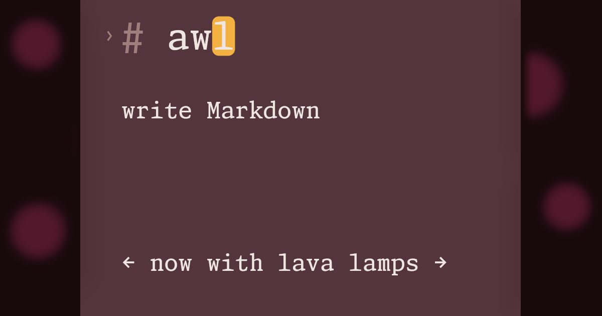

# A room for writing

Plain text stays plain. The view becomes *quietly expressive*, with **weight** where it helps and a [way back home](https://awl-editor.fly.dev/) when it does not.

## Under the hands

- Prose remains the centre
- `inline code` keeps its own voice
- Every world uses the same instrument

| Source | View |
| --- | --- |
| Markdown | composed writing |
| Local file | portable text |

